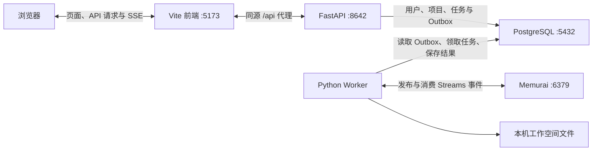

# NarrifyAudio

NarrifyAudio 是 Windows 本地有声书制作工作台，支持项目管理、文本排版、章节核对、剧本解析和音频制作。前端使用 Vue 3 + TypeScript，后端使用 FastAPI，制作任务由独立 Worker 执行，数据与队列分别由 PostgreSQL 和 Memurai 提供。

本指南面向全新的 Windows 10/11 x64 电脑，采用正式安装的 Python、Node.js、PostgreSQL 和 Memurai。PostgreSQL 与 Memurai 作为 Windows 服务运行，API、Worker 和前端作为本地进程运行；安装和控制数据服务时需要管理员授权（UAC）。

基础部署不需要 GPU、CUDA 或本地 TTS 模型，可以先完成登录、项目管理、文本排版和章节核对。剧本解析需要另外配置可访问的 LLM 服务；本地语音合成需要另外准备 TTS 环境。

Linux 完整部署见 [readme-linux.md](readme-linux.md)，包含 Redis、systemd、Nginx、LLM 和 GPU TTS 的安装与验收链路。

- 第一次部署：按[首次安装](#首次安装)的 8 个步骤执行。
- 已安装的电脑：查看[日常启停](#日常启停)。
- 扩展制作功能：查看[可选制作能力](#可选制作能力)。
- 遇到启动或任务问题：查看[常见问题](#常见问题)。

## 部署链路

新电脑的安装顺序为：**工具链 → 数据服务 → 项目依赖 → 数据库用户与 `.env` → 数据库迁移 → API / Worker / 前端 → 登录与任务验收**。



API 负责接收请求，Worker 负责执行长时任务。只启动前端和 API，页面可能能打开，但制作任务不会正常完成。PostgreSQL 保存业务记录，Memurai 提供 Redis 协议队列；二者都要就绪。

## 新电脑需要安装什么

| 组件 | 安装方式 | 是否注册 Windows 服务 | 基础部署是否需要 |
| --- | --- | --- | --- |
| Git | [Git for Windows 安装器](https://git-scm.com/downloads/win)，或 winget `Git.Git` | 否 | 拉取和更新源码需要 |
| Node.js 24 LTS + npm | [Node.js Windows MSI](https://nodejs.org/en/download)，或 winget `OpenJS.NodeJS.LTS` | 否 | 前端依赖安装、构建及 Vite 需要 |
| Python 3.14 x64 | [Python 官方 Windows 安装器](https://www.python.org/downloads/windows/)，或 winget `Python.Python.3.14`；启用 Python Launcher 和 PATH | 否 | API、Worker 和迁移需要 |
| PostgreSQL 16 x64 | [PostgreSQL 官网提供的 EDB Windows 安装器](https://www.postgresql.org/download/windows/)；安装 Server 和 Command Line Tools | 是，名称 `postgresql-x64-16` | 必需 |
| Memurai Developer | [Memurai MSI](https://docs.memurai.com/en/installation)，或 winget `Memurai.MemuraiDeveloper`；选择安装为服务 | 是，名称 `Memurai` | 必需；本地 Redis 协议服务 |
| FFmpeg / ffprobe | winget `Gyan.FFmpeg` 安装并管理命令行工具，加入 PATH | 否 | 音频探测、切分、导出需要；纯文本流程可后装 |
| SoX_ng | winget `sox_ng.sox_ng` 安装命令行工具 | 否 | TTS 音频辅助工具，基础部署可跳过 |
| CUDA 版 PyTorch、Qwen3-TTS 和模型 | 在项目 `.venv` 中按后文 TTS 步骤安装，模型按应用配置下载 | 否，由 Worker 拉起隔离子进程 | 可选；无 NVIDIA GPU 的电脑先跳过 |

FFmpeg 和 SoX_ng 的 winget 包由上游二进制压缩包安装，属于 winget 管理的命令行工具，不是数据库服务。基础方案不使用 MSYS2、便携 Python/Node 或用户进程形式的数据库。

## 服务与本机地址

| 服务 | 用途 | 地址 / 端口 | 启动方式 |
| --- | --- | --- | --- |
| PostgreSQL 16 | 用户、项目、任务和配置数据 | `127.0.0.1:5432` | Windows 服务 `postgresql-x64-16` |
| Memurai Developer | Redis 协议缓存和任务队列 | `127.0.0.1:6379` | Windows 服务 `Memurai` |
| FastAPI | 应用 API | `http://127.0.0.1:8642` | `.venv` 中的 Python |
| Worker | 执行后台制作任务 | 与 API 共用 `.venv` | `.venv` 中的 Python |
| Vite | 用户端和管理控制台 | `http://127.0.0.1:5173` | Node.js / npm |

## 首次安装

以下步骤完成基础部署，暂不安装 TTS / CUDA。除标明“管理员 PowerShell”的系统设置和服务控制外，项目命令均在仓库根目录的普通 PowerShell 中执行。

### 1. 安装工具链

先确认系统有 winget（Windows“应用安装程序”提供）。没有 winget 时，使用上表中的官方安装器。以下命令逐条执行，等待每次安装完成并确认成功；不要并行运行多个 MSI 安装器。

```powershell
winget --version
winget install --id Git.Git --exact --source winget
winget install --id OpenJS.NodeJS.LTS --exact --source winget
winget install --id Python.Python.3.14 --exact --source winget
```

Python 使用常规 x64 版本；本指南不使用 embeddable 包或自由线程版本。安装器需要提供 `py -3.14`，使用官方经典安装器时勾选 Python Launcher 和“Add Python to PATH”。

安装结束后**重新打开 PowerShell**，检查版本及命令位置：

```powershell
git --version
node --version
npm.cmd --version
py -3.14 --version
Get-Command node, npm.cmd, python -ErrorAction SilentlyContinue | Select-Object Name, Source
```

若 `py` 不可用，先修复 Python Launcher 的安装，或使用已安装 Python 3.14 的完整路径代替下文的 `py -3.14`。不要从旧电脑复制 `.venv` 或 `node_modules`。

### 2. 安装 PostgreSQL 与 Memurai Windows 服务

PostgreSQL 建议使用交互式安装，明确选择 **16**、Server 和 Command Line Tools，端口 **5432**，服务名称 **`postgresql-x64-16`**。pgAdmin 可选，Stack Builder 无需额外安装组件。安装时设置并保存 `postgres` 管理员密码，后面创建应用数据库会用到。

```powershell
winget install --id PostgreSQL.PostgreSQL.16 --exact --source winget --interactive
winget install --id Memurai.MemuraiDeveloper --exact --source winget
```

Memurai 安装器应启用 Windows 服务，保持服务名称 **`Memurai`** 和端口 **6379**。本指南所有连接均使用本机地址，不需要向局域网开放端口。Memurai 提供 Redis 协议服务，无需另外安装 Redis。

安装完成后确认服务已注册：

```powershell
Get-Service postgresql-x64-16, Memurai
```

`launch/start.ps1` 使用上述固定服务名称和本机端口；改成其他名称或端口，不能直接按默认启动流程运行。只有文件目录存在、没有注册 Windows 服务，也不能满足启动条件。

### 3. 获取源码并启用 Windows 长路径

通过 Git 克隆项目，进入含有 `package.json`、`alembic.ini`、`launch/` 的仓库根目录。后面的项目命令都从这里执行。选择较短、当前用户可写的目录，不放在 `Program Files` 下。

工作空间按用户、项目、任务和尝试多层组织，产物路径可能超过 260 字符。在**管理员 PowerShell** 中按 [Windows 长路径说明](https://learn.microsoft.com/en-us/windows/win32/fileio/maximum-file-path-limitation)开启支持：

```powershell
Set-ItemProperty -LiteralPath 'HKLM:\SYSTEM\CurrentControlSet\Control\FileSystem' -Name LongPathsEnabled -Type DWord -Value 1
```

完成系统设置后重启电脑，再从仓库根目录继续下一步。项目依赖使用普通 PowerShell 安装。

### 4. 安装前端和基础 Python 依赖

```powershell
npm.cmd ci
py -3.14 -m venv .venv
.\.venv\Scripts\python.exe -m pip install --upgrade pip
```

**当前 `backend/requirements.txt` 合并了基础应用、TTS 和测试依赖。** 如果暂不使用 TTS，不要直接执行 `pip install -r backend/requirements.txt`，也不要执行 `install_tts_env.ps1`；前者会安装 Qwen3-TTS 等大型依赖，后者会安装 CUDA 版 PyTorch 并强制检查 GPU。

从同一份依赖声明中安装基础应用所需部分：

```powershell
$basePackages = @(
  'fastapi>=0.115',
  'uvicorn>=0.30',
  'pydantic>=2.8',
  'python-multipart>=0.0.9',
  'SQLAlchemy>=2.0.36',
  'alembic>=1.14',
  'psycopg[binary]>=3.2',
  'redis>=5.2',
  'psutil>=6.0'
)
.\.venv\Scripts\python.exe -m pip install @basePackages
.\.venv\Scripts\python.exe -m pip check
.\.venv\Scripts\python.exe -c "import backend.main, backend.worker; print('API / Worker imports OK')"
```

无需激活虚拟环境；直接使用 `.venv\Scripts\python.exe` 可以确保 API、Worker 和 Alembic 共用项目环境。以后基础依赖声明变化时，应同步核对上述列表。

### 5. 启动数据服务，创建应用用户与数据库

双击仓库内的 `launch/start-data-services.bat`，确认 UAC 提示；或在管理员 PowerShell 的仓库根目录执行：

```powershell
.\launch\start-data-services.ps1
```

脚本等待 PostgreSQL 的 5432 和 Memurai 的 6379 端口就绪。随后回到普通 PowerShell，用正式 PostgreSQL 的 `psql` 创建应用用户：

```powershell
$pgBin = Join-Path $env:ProgramFiles 'PostgreSQL\16\bin'
& (Join-Path $pgBin 'psql.exe') -h 127.0.0.1 -p 5432 -U postgres -d postgres -W
```

在密码提示中输入安装时设置的 `postgres` 管理员密码。连接成功后，在 **psql 提示符**中逐行执行：

```text
CREATE ROLE narrify LOGIN;
\password narrify
CREATE DATABASE narrify OWNER narrify ENCODING 'UTF8' TEMPLATE template0;
\q
```

`\password narrify` 会提示设置应用数据库密码。上述步骤只用于首次初始化；若角色或数据库已存在，先核对现有配置，不要重复创建或删除原库。

验证应用用户能连接，并确认中文数据使用 UTF8：

```powershell
& (Join-Path $pgBin 'psql.exe') -h 127.0.0.1 -p 5432 -U narrify -d narrify -W -c 'SELECT current_user, current_database(); SHOW server_encoding;'
```

### 6. 配置 `.env`

仅首次创建配置文件；已有文件时不要覆盖：

```powershell
if (-not (Test-Path -LiteralPath .env)) { Copy-Item .env.example .env }
notepad .env
```

填写以下四项，替换所有占位符：

```text
NARRIFY_DATABASE_URL=postgresql+psycopg://narrify:<URL编码后的应用数据库密码>@127.0.0.1:5432/narrify
NARRIFY_REDIS_URL=redis://127.0.0.1:6379/0
NARRIFY_BOOTSTRAP_ADMIN_EMAIL=admin@example.com
NARRIFY_BOOTSTRAP_ADMIN_PASSWORD=<另设的应用管理员登录密码>
```

三套密码用途不同：

| 凭据 | 用途 | 配置位置 |
| --- | --- | --- |
| PostgreSQL `postgres` 密码 | 创建数据库、数据库运维 | 安装时设置，不写入 `.env` |
| PostgreSQL `narrify` 密码 | API / Worker 连接应用数据库 | `.env` 的 `NARRIFY_DATABASE_URL` |
| 应用管理员密码 | 登录管理控制台 | 首次启动时由 `NARRIFY_BOOTSTRAP_ADMIN_PASSWORD` 初始化 |

数据库 URL 中的密码按 URL 编码，例如 `@` 写成 `%40`；psql 的密码提示中仍输入原始密码。bootstrap 邮箱使用有效邮箱格式，密码另设，不能保留示例占位符。`.env` 已被 Git 忽略，不提交真实凭据。

API 和 Worker 本身不自动读取 `.env`；`launch/start.ps1` 统一注入其中的 `NARRIFY_*`。修改配置后需停止旧 API / Worker，再重新启动。

### 7. 迁移数据库并启动应用

在仓库的 `launch/` 目录双击 `start.bat`，或从普通 PowerShell 执行：

```powershell
.\launch\start.ps1
```

数据服务应已启动，此时普通用户无需再次控制服务。脚本会先检查服务与端口，导入 `.env`，在 API 尚未启动时运行 `alembic upgrade head`，然后按需打开 API、Worker、Vite 三个控制台，等待 API / 前端就绪后打开浏览器。

`launch/start.ps1` **不会自动安装软件、创建 `.venv`、安装 npm 包或创建数据库用户与数据库**。缺少 Python 环境时回到第 4 步，不必按脚本提示安装完整 TTS 环境。

API 首次启动会根据 bootstrap 配置创建管理员及默认项目。账号已经存在时不会重置密码；之后修改 `.env` 的 bootstrap 密码不能用来给旧账号改密。

### 8. 验收完整链路

```powershell
Get-Service postgresql-x64-16, Memurai
Invoke-RestMethod 'http://127.0.0.1:8642/api/health'
Invoke-RestMethod 'http://127.0.0.1:5173/api/health'
```

两项服务应为 Running，两个健康检查都应返回 `ok: true`；第二个请求同时验证了 Vite 到 API 的代理。**健康接口不查询数据库，也不验证 Worker，因此不能只凭 HTTP 200 判断部署完成。**

1. 打开 [管理员登录页](http://127.0.0.1:5173/#/admin/login)，用 `.env` 配置的账号登录，查看管理控制台中的数据库、队列和在线 Worker 状态。这一步验证数据库认证、应用账号和 Cookie session。
2. 在 [用户入口](http://127.0.0.1:5173/#/login) 注册普通账号，进入项目工作台。管理员控制台与用户工作台使用各自入口。
3. 上传一份 UTF8 中文短文本，执行文本排版 / 章节核对流程，确认任务从待处理进入执行并完成，页面能读取生成结果，任务中心能更新完成状态。这一步验证上传、工作空间写入、任务持久化、队列、Worker 和 SSE。
4. 无 GPU 的基础部署不验收语音合成。控制台显示 TTS 引擎文件存在，不代表模型与 CUDA 已能运行。

验收标准：能登录、创建项目、上传中文文本，且排版任务能由 Worker 执行完成并显示结果。

## 日常启停

### 启动

1. 双击 `launch/start-data-services.bat`，确认 UAC 授权，等待 PostgreSQL 与 Memurai 就绪。
2. 双击 `launch/start.bat`，等待 API、Worker 和 Vite 启动，浏览器会打开登录页。

启动脚本会复用已运行的进程。数据服务已经运行时，可直接执行第 2 步；修改 `.env` 或更新代码后，应先停止旧应用进程。

| 入口 | 地址 |
| --- | --- |
| 用户工作台 | [用户登录](http://127.0.0.1:5173/#/login) |
| 管理控制台 | [管理员登录](http://127.0.0.1:5173/#/admin/login) |
| API 文档 | [交互式接口文档](http://127.0.0.1:8642/docs) |
| API 健康检查 | [健康接口](http://127.0.0.1:8642/api/health) |

### 停止

1. 等待制作任务结束，双击 `launch/stop.bat` 并确认 UAC 授权。脚本先停止本项目的 API、Worker、Vite 及其子进程，再停止 Memurai 和 PostgreSQL；结果窗口按键后关闭。
2. 只停止应用、保留数据服务时，在普通 PowerShell 执行 `.\launch\stop.ps1 -AppOnly`。单独停止数据服务仍可使用 `launch/stop-data-services.bat`，但应先确认应用进程已退出。

可执行 `.\launch\stop.ps1 -WhatIf` 预览停止范围，不会实际停止进程或服务。统一停止会中断仍在运行的制作任务，请先等待任务结束。

| PowerShell 命令 | 所需权限 |
| --- | --- |
| `.\launch\start-data-services.ps1` | 管理员，启动数据服务 |
| `.\launch\start.ps1` | 普通用户，数据服务须已运行 |
| `.\launch\stop.ps1` | 管理员，停止应用及数据服务 |
| `.\launch\stop.ps1 -AppOnly` | 普通用户，停止自己的应用进程，保留数据服务 |
| `.\launch\stop-data-services.ps1` | 管理员，应用进程须已退出 |

## 可选制作能力

### LLM 剧本解析

在管理控制台的应用设置中配置可访问的 LLM 地址、模型和凭据；使用远程服务不需要本机 CUDA。若手动使用本机 LLM 服务，先独立安装并启动对应服务，再填入它的 API 地址。单 GPU 同时需要 LLM 和 TTS 时，可以在管理员“解析与 LLM”配置前台启动/停止脚本，在“Worker / Queue”启用[动态 GPU 服务调度](docs/GPU_SCHEDULER.md)；启用前停止原独立运行的 LLM 服务。调度默认关闭。调用计费任务前通过管理控制台给用户配置足够额度。凭据与制作参数由应用设置管理，不写入前端、README 或源码。

### FFmpeg 音频处理

仅音频切分、探测、导出时，安装 FFmpeg 即可，不必安装 TTS / CUDA：

```powershell
winget install --id Gyan.FFmpeg --exact --source winget
```

重新打开 PowerShell，检查两个命令都可用，再重启 API / Worker，让它们继承新 PATH：

```powershell
Get-Command ffmpeg, ffprobe | Select-Object Name, Source
ffmpeg -version
ffprobe -version
```

### 本地 TTS（可选，有可用 NVIDIA GPU 后再部署）

基础部署完成后，再准备 NVIDIA 驱动、足够的显存与磁盘空间，安装 SoX_ng，并安装共享 TTS 环境：

```powershell
winget install --id sox_ng.sox_ng --exact --source winget
# 重新打开 PowerShell，停止 API / Worker 后执行：
.\install_tts_env.ps1 -PythonVersion 3.14
```

当前安装脚本使用 uv 管理依赖和 Python，向 `.venv` 安装完整 `backend/requirements.txt`，最后安装 CUDA 版 torch / torchaudio 并检查 `torch.cuda.is_available()`。已有同版本 `.venv` 时继续使用它；没有可用 GPU 时该检查会失败，不能把此脚本当成基础应用的必需安装步骤。

启动脚本检测到 winget 安装的 SoX_ng 后，会在忽略目录 `.narrify/bin` 中建立 `sox.exe` 兼容副本。TTS 模型仍需按应用设置下载或指定可访问目录；包能导入、引擎文件存在和模型能实际合成是不同的验收阶段。完成后使用短文本做真实合成测试。

只有真实 TTS 测试发现 Python 3.14 不兼容时才考虑 `-PythonVersion 3.10 -Recreate`；该参数会删除并重建共享 `.venv`，应先停止 API / Worker，之后重新验证基础应用。

## 目录和关键配置

- `src/`：Vue 页面、组件、API 客户端和状态管理。
- `backend/`：FastAPI 路由、业务逻辑、数据库模型和 Worker。
- `launch/`：Windows 和 Linux 启停及开发预览脚本；Linux `.sh` 用法见 [Linux 部署指南](readme-linux.md)。
- `tts-engine/`：隔离运行的 TTS 子进程代码。
- `backend/resources/`：提示词和运行资源。
- `.env`：本机数据库、队列和初始管理员配置；不要提交。
- `setting.json`：已跟踪的根目录默认配置模板，也保存运行时工作空间指针；提交前保持路径为空且不含真实凭据。工作空间配置使用 `config/setting.json`。旧工作空间的 `config/app.json` 可继续读取；初始化或保存设置时生成新文件，并保留旧文件作为备份。两个文件并存时优先使用 `setting.json`。从旧版本升级时，先备份旧根目录 `app.json`，按需将其内容迁入 `setting.json`。
- `storage/`：默认工作空间与任务产物目录；实际根目录以应用存储设置为准。
- `config/`、`logs/`、`.narrify/`、`.backups/`：本机运行时配置、日志或备份，不提交，也不作为源码清理。

常用 `.env` 配置：

| 变量 | 说明 |
| --- | --- |
| `NARRIFY_DATABASE_URL` | 应用数据库连接串 |
| `NARRIFY_REDIS_URL` | Memurai/Redis 连接串 |
| `NARRIFY_BOOTSTRAP_ADMIN_EMAIL` | 首次初始化管理员邮箱 |
| `NARRIFY_BOOTSTRAP_ADMIN_PASSWORD` | 首次初始化管理员密码 |

部署配置放在 `.env`；LLM 凭据、用户额度和制作参数通过应用设置管理。数据库与工作空间文件共同组成项目数据，搬迁或备份时需要同时保留。

## 常见问题

先查看 Backend、Worker、Frontend 控制台中的**首个错误**，再按下表定位：

| 现象 | 优先检查与处理 |
| --- | --- |
| 命令不存在或指向旧环境 | 重开 PowerShell，用 `Get-Command` 核对路径；重启应用以更新其 PATH。`psql` 未加入 PATH 时用正式安装目录下的完整路径 |
| PowerShell 拒绝执行脚本 | 使用仓库的 `.bat` 入口；或单次执行 `powershell.exe -NoProfile -ExecutionPolicy Bypass -File .\launch\start.ps1`。服务控制仍需管理员权限 |
| 找不到 PostgreSQL / Memurai 服务 | 确认安装器注册了 `postgresql-x64-16` 和 `Memurai`，仅解包工具文件不能满足启动条件 |
| 数据服务已安装但未运行 | 双击 `launch/start-data-services.bat` 并确认 UAC；失败时查看服务日志与 Windows 事件查看器 |
| 数据库认证失败 | 按首次安装第 5 步用 `narrify` 用户独立连接；核对原始密码、URL 编码、数据库名。修改 `.env` 后重启 API / Worker |
| 页面能打开，任务一直待处理 | 查看 Worker 是否在线、Memurai 是否可连接及 Worker 控制台错误；先用不依赖 LLM / TTS 的排版任务验收 |
| 排版正常，剧本解析失败 | 核对 LLM 地址、模型、凭据和用户额度 |
| 缺少 `.venv` 或 Python 模块 | 回到首次安装第 4 步；基础部署无需安装 TTS |
| CUDA / TTS 安装失败 | 无可用 GPU 时跳过 TTS；已有基础环境仍可运行文本工作台 |
| 文件名过长或产物写入失败 | 开启长路径支持并重启电脑，同时选择较短、可写的工作空间根目录 |
| 5173 / 8642 端口被占用 | 核对监听进程是否属于本项目，停止旧实例后再启动；不要直接结束无关进程 |

常用诊断命令：

```powershell
Get-Service postgresql-x64-16, Memurai
Get-Command node, npm.cmd, python -ErrorAction SilentlyContinue | Select-Object Name, Source
Get-NetTCPConnection -State Listen -LocalPort 5173,5432,6379,8642 -ErrorAction SilentlyContinue
Get-ItemProperty -LiteralPath 'HKLM:\SYSTEM\CurrentControlSet\Control\FileSystem' -Name LongPathsEnabled
```

## 开发与更新

### 开发命令

单独启动 API / Worker 或执行 Alembic 前，必须在对应终端导入与 `.env` 一致的 `NARRIFY_*` 环境变量；默认使用 `launch/start.bat` 统一注入。以下后端启动命令不会自行读取 `.env`。

开发回归所需工具与基础运行依赖分开安装；不必因此安装 TTS：

```powershell
.\.venv\Scripts\python.exe -m pip install 'pytest>=9.1' 'pytest-xdist>=3.8' 'httpx2>=2.13' import-linter
```

```powershell
npm.cmd run dev                 # 仅启动前端
.\.venv\Scripts\python.exe -m backend.main   # 仅启动 API
.\.venv\Scripts\python.exe -m backend.worker # 仅启动 Worker
npm.cmd run typecheck           # 前端类型检查
npm.cmd run build               # 类型检查并构建前端
npm.cmd run build:all           # 前端构建 + 后端编译检查 + 分层门禁（lint-imports）
.\.venv\Scripts\python.exe -m pytest backend/tests -n 4 --dist loadscope
```

基础部署只需完成登录与任务验收；开发改动按 `AGENTS.md` 执行检查。后端测试固定使用 `-n 4 --dist loadscope`。

### 构建前端

`npm.cmd run build` 生成 `dist/`。FastAPI 可直接提供其中的静态页面，构建后也可从 `http://127.0.0.1:8642` 访问工作台；此模式仍需 PostgreSQL、Memurai 和独立 Worker，只是不再需要 Vite。默认 `launch/start.bat` 仍会启动 Vite。

生产前端默认向当前页面的同源 `/api` 发请求，适用于由 FastAPI 提供构建文件或反向代理统一入口的部署。若前端与 API 分域，在构建前设置 `VITE_API_BASE`；若后端修改了 `NARRIFY_CSRF_COOKIE`，同时设置 `VITE_CSRF_COOKIE_NAME`。这些 `VITE_` 值会写入前端构建结果，变更后需要重新构建；分域部署还需配置后端允许的来源和 Cookie 策略。

### 更新与备份

1. 等待制作任务结束，停止 API、Worker 和 Vite，暂时保留数据服务。
2. 备份应用数据库、实际工作空间目录以及 `.env` 和本机配置。数据库备份示例见下方。
3. 更新源码，执行 `npm.cmd ci`；基础 Python 依赖有变化时按首次安装第 4 步同步安装，使用 TTS 的电脑再核对对应依赖。
4. 运行 `launch/start.bat`，由启动脚本迁移数据库并启动应用，再完成登录与任务验收。

数据库备份命令在仓库根目录执行，提示时输入 `narrify` 的原始密码；数据库 dump 不包含工作空间文件：

```powershell
New-Item -ItemType Directory -Path .backups -Force | Out-Null
$backupFile = Join-Path '.backups' ('narrify-' + (Get-Date -Format 'yyyyMMdd-HHmmss') + '.dump')
& "$env:ProgramFiles\PostgreSQL\16\bin\pg_dump.exe" -h 127.0.0.1 -p 5432 -U narrify -d narrify -W -Fc -f $backupFile
```

升级使用 Alembic 迁移，不通过删除数据库重新初始化。迁移会修复旧版孤立 Project / Workspace 的关联记录，不删除或移动用户工作空间文件；迁移前的备份仍需保留。
