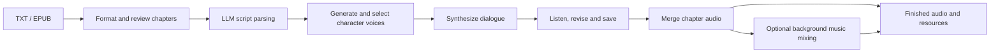
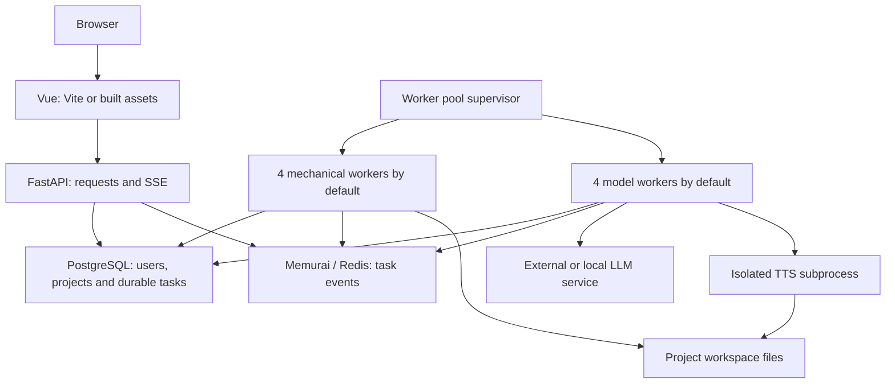

# NarrifyAudio

[English](README.md) | [简体中文](README.zh-CN.md)

NarrifyAudio is a self-hosted audiobook production workbench. Turn TXT and EPUB manuscripts into chapter scripts, generate and select character voices, synthesize dialogue, review individual lines, and produce chapter audio with optional background music.

Version **0.1.0**. Run locally on Windows or deploy on Linux. The application uses Vue 3 + TypeScript, FastAPI, PostgreSQL, a Redis-compatible service, and independent task workers. Model services and audio tools are installed separately; see the platform guides for prerequisites and validation boundaries.

## Capabilities

| Area | What you can do | Requirements |
| --- | --- | --- |
| Manuscripts | Import and reorder multiple TXT/EPUB files; format text, split chapters, review boundaries | Base application; no GPU or LLM |
| Scripts | Identify speakers, dialogue and delivery instructions; review parsing checks | Reachable LLM service and application character quota |
| Character voices | Infer descriptions, generate candidate voices, listen and select a reference voice | LLM for descriptions; local TTS for candidates; character quota |
| Audio production | Synthesize lines, revise and re-render previews, merge chapters | TTS and character quota for synthesis/previews; FFmpeg/ffprobe and Python audio dependencies for audio processing |
| Background music | Match music, optionally analyze scenes with an LLM, review timelines and mix narration | Music library and audio tools; LLM/quota for scene analysis |
| Projects and resources | Track progress, inspect materials, preview/download eligible finished audio, package exports, manage storage and the recycle bin | Base application; audio tools for relevant operations |
| Administration | Manage users, character quotas, settings, tasks, workers and optional local GPU service scheduling | Separate administrator account |

EPUB import extracts text in reading order; encrypted text and image-only scans are unsupported. Parsing and voice generation require human review and listening. Character matching offers hints and manual merging, rather than automatic identity resolution or a user interface for uploading real-person voice samples.

## Production workflow



Saving preview edits can invalidate that chapter's earlier merged audio and BGM results; rebuild affected outputs after revisions. Production materials and finished deliverables have different export rules: an audio file's folder alone does not make it downloadable. See the [production guide](docs/production.en.md) for the first-book walkthrough and resource rules.

## Get started

1. Follow the [Windows deployment guide](docs/windows.en.md) or [Linux deployment guide](docs/linux.en.md). Install the base application before adding model capabilities.
2. Sign in through the administrator portal to configure the platform, registration and quotas. Use a separate ordinary user account for production.
3. Import a short UTF-8 manuscript into a project and complete a formatting task. Confirm that the worker finishes it and the page displays its results; the health endpoint alone does not validate deployment.
4. Add a reachable LLM service, local TTS models and the audio tools needed for your workflow. Allocate character quota before model tasks, then validate a short sample before a full book.

Application quotas count characters; they are separate from an upstream provider's tokens or monetary charges. Installing the application does not install an LLM service or prove that TTS models can synthesize successfully.

Default Windows development addresses are `http://127.0.0.1:5173/#/login` for users and `http://127.0.0.1:5173/#/admin/login` for administrators. A built frontend can be served by FastAPI without Vite; daily start/stop commands are in the platform guides.

## Architecture



Use `python -m backend.worker_pool` for the complete worker service. Worker process counts, admitted tasks and simultaneous model requests are separate limits. LLM requests share a machine-wide concurrency limit; optional single-GPU service scheduling is disabled by default. See [operations](docs/operations.en.md) before changing pool sizes or enabling scheduling.

## Documentation and development

| Guide | English | 简体中文 |
| --- | --- | --- |
| Windows installation and daily use | [Windows](docs/windows.en.md) | [Windows](docs/windows.md) |
| Linux deployment | [Linux](docs/linux.en.md) | [Linux](readme-linux.md) |
| First audiobook and production rules | [Production](docs/production.en.md) | [制作指南](docs/production.md) |
| Configuration, backup, upgrades and scheduling | [Operations](docs/operations.en.md) | [运维与迁移](docs/operations.md) |
| Architecture, development and tests | [Development](docs/development.en.md) | [开发指南](docs/development.md) |

After installing development dependencies:

```sh
npm ci
npm run build
npm run build:all
```

The development guide explains Python tooling, the local backend test command `pytest backend/tests -n 4 --dist loadscope`, and feature-specific regressions. Follow existing layers and tests; use Conventional Commits when committing. Keep credentials, local configurations and generated workspace files out of contributions.

Back up the database, actual workspace files and local configuration together before upgrades or migrations. A ZIP of finished audio is not a project backup.

## License

The repository is licensed under [GNU AGPL version 3](LICENSE). Models, source texts and music retain their respective licenses; check their terms before use or distribution.

### Qwen3-TTS attribution and third-party licensing

NarrifyAudio provides installation and integration support for [Qwen3-TTS](https://github.com/QwenLM/Qwen3-TTS), developed by the Alibaba Cloud Qwen team. The installation script installs `qwen-tts==0.1.1`; the runtime loads the selected models. The dependency package and model weights are not included in this source repository.

Qwen3-TTS code is licensed under [Apache License 2.0](https://github.com/QwenLM/Qwen3-TTS/blob/main/LICENSE). The default models and tokenizer are also published under Apache-2.0:

| Component | Official model repository |
| --- | --- |
| CustomVoice | [Qwen3-TTS-12Hz-1.7B-CustomVoice](https://huggingface.co/Qwen/Qwen3-TTS-12Hz-1.7B-CustomVoice) |
| Base | [Qwen3-TTS-12Hz-1.7B-Base](https://huggingface.co/Qwen/Qwen3-TTS-12Hz-1.7B-Base) |
| VoiceDesign | [Qwen3-TTS-12Hz-1.7B-VoiceDesign](https://huggingface.co/Qwen/Qwen3-TTS-12Hz-1.7B-VoiceDesign) |
| Tokenizer | [Qwen3-TTS-Tokenizer-12Hz](https://huggingface.co/Qwen/Qwen3-TTS-Tokenizer-12Hz) |

Third-party components retain their original licenses; NarrifyAudio's AGPL-3.0 does not replace them. If you redistribute Qwen3-TTS code or model weights, including in an installer, container image or offline bundle, provide a copy of Apache-2.0 and retain applicable copyright and attribution notices. Mark changes to upstream files and preserve applicable upstream `NOTICE` content when supplied, as required by [Apache-2.0 section 4](https://www.apache.org/licenses/LICENSE-2.0#redistribution). This README attribution does not replace the license files required for redistribution. Check the original terms separately for other dependencies, replacement models and source materials.
