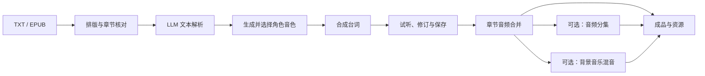
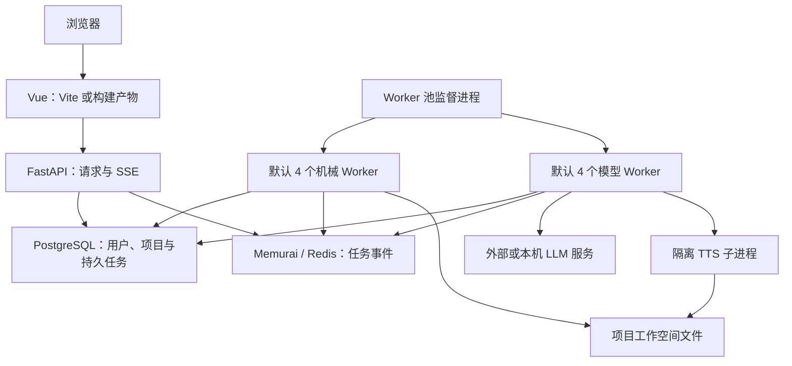

# NarrifyAudio

[English](README.md) | [简体中文](README.zh-CN.md)

NarrifyAudio 是可自托管的有声书制作工作台。将 TXT、EPUB 原稿整理为章节剧本，生成并选择角色音色，合成台词，逐句试听修订，制作章节音频，并按需分集或添加背景音乐。

当前版本 **0.1.0**。支持 Windows 本地运行与 Linux 部署，使用 Vue 3 + TypeScript、FastAPI、PostgreSQL、Redis 协议兼容服务和独立任务 Worker。模型服务与音频工具需要另行准备；前置条件和验收边界见平台指南。

## 核心能力

| 模块 | 可以做什么 | 所需条件 |
| --- | --- | --- |
| 原稿处理 | 导入并排序多个 TXT/EPUB，排版分册，核对章节边界 | 基础应用，无需 GPU 或 LLM |
| 文本解析 | 识别角色、台词和语音指导，核对解析检查项 | 可访问的 LLM 服务、应用字符额度 |
| 角色音色 | 推理声音描述，生成候选音色，试听并选择参考声音 | 描述需要 LLM，候选需要本地 TTS；字符额度 |
| 音频制作 | 合成台词，修订与重渲染预览，合并章节，按需分集 | 合成/预览需要 TTS 和字符额度；音频处理需要 FFmpeg/ffprobe 与 Python 音频依赖 |
| 背景音乐 | 匹配音乐，按需调用 LLM 分析场景，核对时间轴并混音 | 音乐库、音频工具；场景分析需要 LLM 和额度 |
| 项目与资源 | 查看制作进度，检查资料，试听和下载合格成品，打包导出，管理存储与回收站 | 基础应用；相关音频操作需要音频工具 |
| 管理控制台 | 管理用户、字符额度、配置、任务、Worker 与可选本机 GPU 服务调度 | 独立管理员账号 |

EPUB 按阅读顺序提取正文，不支持加密正文或纯图片扫描版。解析与音色生成仍需人工核对和试听。角色关联提供提示和手动合并，不自动判定人物身份，也没有上传真人声音样本的用户界面。

## 制作流程



保存预览修改可能使本章原有合并音频和 BGM 结果失效，需要重新制作受影响的输出。制作资料与成品采用不同导出规则，文件位于音频目录并不自动获得下载资格。第一本书的操作路线及资源规则见[制作指南](docs/production.md)。

## 开始使用

1. 按 [Windows 部署指南](docs/windows.md)或 [Linux 部署指南](readme-linux.md)完成基础部署，再添加模型能力。
2. 从管理员入口配置平台、注册方式和额度；制作时使用独立普通用户账号。
3. 在项目中导入短篇 UTF-8 原稿，完成一次排版任务。确认 Worker 执行完成且页面显示结果；健康接口不能单独证明部署成功。
4. 配置可访问的 LLM、本地 TTS 模型及所需音频工具。模型任务提交前分配字符额度，先验收短样本，再制作整本书。

应用额度按字符计算，与上游服务的 token 和货币费用分别管理。安装应用不等于安装 LLM 服务，也不能证明 TTS 模型已能实际合成。

Windows 默认开发地址：用户入口 `http://127.0.0.1:5173/#/login`，管理员入口 `http://127.0.0.1:5173/#/admin/login`。构建后的前端可由 FastAPI 提供，无需运行 Vite；日常启停命令见平台指南。

## 架构概览



完整 Worker 服务使用 `python -m backend.worker_pool`。Worker 进程数、获准执行的任务数和同时模型请求数是不同限制。LLM 请求共用全机并发上限，可选单 GPU 服务调度默认关闭。扩容或启用调度前阅读[运维指南](docs/operations.md)。

## 文档与开发入口

| 指南 | English | 简体中文 |
| --- | --- | --- |
| Windows 安装与日常使用 | [Windows](docs/windows.en.md) | [Windows](docs/windows.md) |
| Linux 部署 | [Linux](docs/linux.en.md) | [Linux](readme-linux.md) |
| 第一本书与制作规则 | [Production](docs/production.en.md) | [制作指南](docs/production.md) |
| 配置、备份、升级与调度 | [Operations](docs/operations.en.md) | [运维与迁移](docs/operations.md) |
| 架构、开发与测试 | [Development](docs/development.en.md) | [开发指南](docs/development.md) |

安装开发依赖后执行：

```sh
npm ci
npm run build
npm run build:all
```

开发指南列出 Python 工具、本地后端测试命令 `pytest backend/tests -n 4 --dist loadscope` 及各功能回归。贡献遵循现有分层和测试约定，提交时使用 Conventional Commits。不要将凭据、本机配置和工作空间产物纳入贡献。

升级或迁移前共同备份数据库、实际工作空间文件与本机配置。成品音频 ZIP 不能替代项目备份。

## 许可证

仓库采用 [GNU AGPL 第 3 版](LICENSE)。模型、原文和音乐分别遵循各自许可证，使用或分发前核对其条款。

### Qwen3-TTS 署名与第三方许可

NarrifyAudio 提供 [Qwen3-TTS](https://github.com/QwenLM/Qwen3-TTS) 的安装与调用支持。Qwen3-TTS 由 Alibaba Cloud Qwen 团队开发；安装脚本安装 `qwen-tts==0.1.1`，运行时加载所选模型。本源码仓库不包含该依赖包或模型权重。

Qwen3-TTS 代码采用 [Apache License 2.0](https://github.com/QwenLM/Qwen3-TTS/blob/main/LICENSE)。默认使用的模型与 Tokenizer 也以 Apache-2.0 发布：

| 组件 | 官方模型仓库 |
| --- | --- |
| CustomVoice | [Qwen3-TTS-12Hz-1.7B-CustomVoice](https://huggingface.co/Qwen/Qwen3-TTS-12Hz-1.7B-CustomVoice) |
| Base | [Qwen3-TTS-12Hz-1.7B-Base](https://huggingface.co/Qwen/Qwen3-TTS-12Hz-1.7B-Base) |
| VoiceDesign | [Qwen3-TTS-12Hz-1.7B-VoiceDesign](https://huggingface.co/Qwen/Qwen3-TTS-12Hz-1.7B-VoiceDesign) |
| Tokenizer | [Qwen3-TTS-Tokenizer-12Hz](https://huggingface.co/Qwen/Qwen3-TTS-Tokenizer-12Hz) |

第三方组件继续遵循其原始许可证，NarrifyAudio 的 AGPL-3.0 不替代这些许可证。再分发 Qwen3-TTS 代码或模型权重（包括安装包、容器镜像或离线包）时，应附带 Apache-2.0 许可证副本，保留适用的版权与署名声明；修改上游文件须注明修改，上游提供 `NOTICE` 时须保留其中适用内容，具体遵循 [Apache-2.0 第 4 条](https://www.apache.org/licenses/LICENSE-2.0#redistribution)。README 中的署名不能替代再分发时所需的许可证文件。其他依赖、替换模型及原始素材的条款应分别核对。
