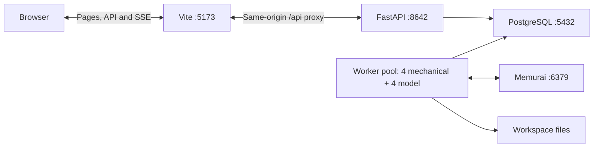

# Windows deployment

[中文](windows.md) · [Home](../README.md) · [Linux](linux.en.md) · [Operations](operations.en.md) · [Development](development.en.md) · [Production workflow](production.en.md)

This guide targets a fresh Windows 10/11 x64 computer. Install Python, Node.js, PostgreSQL and Memurai normally. PostgreSQL and Memurai run as Windows services; the API, Worker pool and Vite run as local processes. Installing or controlling data services requires administrator permission (UAC).

Basic deployment supports login, projects, text formatting and chapter review without a GPU, CUDA or TTS models. Script parsing additionally needs an accessible LLM service. Local speech synthesis needs a separate TTS installation. Source documents support TXT and EPUB, including multiple files ordered into one book; encrypted EPUB content and image-only scans are unsupported.

## Deployment path and requirements

Install tools → data services → project dependencies → database user and `.env` → migrations → API / Worker pool / frontend → login and a real task.



The API accepts requests; independent Workers execute long tasks. Running only the API and frontend does not complete production tasks. PostgreSQL stores business records; Memurai provides the Redis protocol queue. Both must be ready.

| Component | Installation | Windows service | Needed for basic deployment |
| --- | --- | --- | --- |
| Git | [Git for Windows](https://git-scm.com/downloads/win) or winget `Git.Git` | No | Source checkout and updates |
| Node.js 24 LTS / npm | [Official download](https://nodejs.org/en/download) or winget `OpenJS.NodeJS.LTS` | No | Dependencies, builds and Vite |
| Python 3.14 x64 | [Windows downloads](https://www.python.org/downloads/windows/) or winget `Python.Python.3.14` | No | API, Workers and migrations |
| PostgreSQL 16 x64 | [EDB installer via PostgreSQL](https://www.postgresql.org/download/windows/) | `postgresql-x64-16` | Required |
| Memurai Developer | [Memurai MSI](https://docs.memurai.com/en/installation) or winget `Memurai.MemuraiDeveloper` | `Memurai` | Required |
| FFmpeg / ffprobe | winget `Gyan.FFmpeg`, on PATH | No | Audio probing, splitting and export; optional for text |
| SoX_ng | winget `sox_ng.sox_ng` | No | TTS audio helpers; optional for basic deployment |
| CUDA PyTorch, Qwen3-TTS and models | Shared project `.venv`, isolated subprocesses | No | Optional local speech synthesis |

These are the guide's target versions, not a claim that they are the latest releases or compatible with every model and GPU. FFmpeg and SoX_ng are command-line tools, not data services. This deployment does not use MSYS2, portable Python/Node or user-process databases.

| Service | Default address | Start method |
| --- | --- | --- |
| PostgreSQL 16 | `127.0.0.1:5432` | Windows service |
| Memurai | `127.0.0.1:6379` | Windows service |
| FastAPI | `http://127.0.0.1:8642` | Project Python |
| Worker pool | Same `.venv` as API; default 4 + 4 Workers | Project Python |
| Vite | `http://127.0.0.1:5173` | Node / npm |

## First installation

Run project commands in an ordinary PowerShell at the repository root. Use administrator PowerShell only for the indicated system settings and service operations. The first eight steps install the basic application, without CUDA/TTS.

### 1. Install the toolchain

Check winget (provided by Windows App Installer), or use the official installers above. Run each command separately and wait for success; do not run multiple MSI installers concurrently.

```powershell
winget --version
winget install --id Git.Git --exact --source winget
winget install --id OpenJS.NodeJS.LTS --exact --source winget
winget install --id Python.Python.3.14 --exact --source winget
```

Use conventional x64 Python rather than an embeddable or free-threaded build. With the classic installer, enable Python Launcher and Add Python to PATH. The [Python Windows guide](https://docs.python.org/3.14/using/windows.html) also describes the newer install manager; whichever method you use, verify that `py -3.14` selects the intended interpreter.

Open a new PowerShell after installation:

```powershell
git --version
node --version
npm.cmd --version
py -3.14 --version
Get-Command node, npm.cmd, python -ErrorAction SilentlyContinue | Select-Object Name, Source
```

If `py` is unavailable, fix the launcher/manager or substitute the full path to Python 3.14 below. Do not copy `.venv` or `node_modules` from another computer.

### 2. Install PostgreSQL and Memurai services

Use the PostgreSQL installer interactively. Select version **16**, Server and Command Line Tools, port **5432**, and service **`postgresql-x64-16`**. pgAdmin is optional; Stack Builder extras are unnecessary. Save the `postgres` administrator password.

```powershell
winget install --id PostgreSQL.PostgreSQL.16 --exact --source winget --interactive
winget install --id Memurai.MemuraiDeveloper --exact --source winget
Get-Service postgresql-x64-16, Memurai
```

Enable the Memurai Windows service, retain name **`Memurai`** and port **6379**. Use loopback access; opening ports to the LAN is unnecessary. Do not install another Redis instance. The start script checks these fixed service names and ports; a directory of unpacked executables is insufficient.

### 3. Get the source and enable long paths

Choose a short writable parent directory outside Program Files, enter it, then clone:

```powershell
git clone https://github.com/1010323691/NarrifyAudio.git
Set-Location -LiteralPath .\NarrifyAudio
```

Subsequent commands run in this root, containing `package.json`, `alembic.ini` and `launch/`. Workspace task/output paths can exceed 260 characters. Enable [Windows long paths](https://learn.microsoft.com/en-us/windows/win32/fileio/maximum-file-path-limitation) in **administrator PowerShell**, then reboot:

```powershell
Set-ItemProperty -LiteralPath 'HKLM:\SYSTEM\CurrentControlSet\Control\FileSystem' -Name LongPathsEnabled -Type DWord -Value 1
```

### 4. Install frontend and basic Python dependencies

```powershell
npm.cmd ci
py -3.14 -m venv .venv
.\.venv\Scripts\python.exe -m pip install --upgrade pip
```

`backend/requirements.txt` combines application, TTS and test dependencies. For a basic installation, do not install the full file or run `install_tts_env.ps1`: the former installs large TTS packages; the latter installs CUDA PyTorch and requires a working GPU. Install the basic subset:

```powershell
$basePackages = @(
  'fastapi>=0.115',
  'uvicorn>=0.30',
  'pydantic>=2.8',
  'python-multipart>=0.0.9',
  'SQLAlchemy>=2.0.36',
  'alembic>=1.14',
  'psycopg[binary]>=3.2',
  'redis>=5.2',
  'psutil>=6.0'
)
.\.venv\Scripts\python.exe -m pip install @basePackages
.\.venv\Scripts\python.exe -m pip check
.\.venv\Scripts\python.exe -c "import backend.main, backend.worker_pool; print('API / Worker pool imports OK')"
```

Activation is unnecessary: use the explicit interpreter path. Check this subset against the requirements file when dependencies change.

### 5. Start data services and create the application database

Double-click `launch/start-data-services.bat` and accept UAC, or run from administrator PowerShell:

```powershell
.\launch\start-data-services.ps1
```

The script waits for ports 5432 and 6379. Return to ordinary PowerShell and connect as the database administrator:

```powershell
$pgBin = Join-Path $env:ProgramFiles 'PostgreSQL\16\bin'
& (Join-Path $pgBin 'psql.exe') -h 127.0.0.1 -p 5432 -U postgres -d postgres -W
```

Enter the installation's `postgres` password. At the **psql prompt**, run:

```text
CREATE ROLE narrify LOGIN;
\password narrify
CREATE DATABASE narrify OWNER narrify ENCODING 'UTF8' TEMPLATE template0;
\q
```

`\password narrify` prompts for the application's database password. Create only on the first installation; check existing roles/databases rather than deleting or recreating them. Verify authentication and UTF8:

```powershell
& (Join-Path $pgBin 'psql.exe') -h 127.0.0.1 -p 5432 -U narrify -d narrify -W -c 'SELECT current_user, current_database(); SHOW server_encoding;'
```

### 6. Configure `.env`

Create only if absent, then edit:

```powershell
if (-not (Test-Path -LiteralPath .env)) { Copy-Item .env.example .env }
notepad .env
```

Replace all placeholders:

```text
NARRIFY_DATABASE_URL=postgresql+psycopg://narrify:<URL-encoded-application-database-password>@127.0.0.1:5432/narrify
NARRIFY_REDIS_URL=redis://127.0.0.1:6379/0
NARRIFY_BOOTSTRAP_ADMIN_EMAIL=admin@example.com
NARRIFY_BOOTSTRAP_ADMIN_PASSWORD=<separate-application-admin-password>
```

| Credential | Purpose | Location |
| --- | --- | --- |
| PostgreSQL `postgres` password | Database creation / administration | Do not put in application `.env` |
| PostgreSQL `narrify` password | API / Worker database connection | `NARRIFY_DATABASE_URL` |
| Application administrator password | Admin console login | Bootstrap variable on first initialization |

URL-encode the database password, e.g. `@` becomes `%40`; enter the original password at psql prompts. Use a valid administrator email and replace the sample password. `.env` is Git-ignored; never commit credentials.

The API and Workers do not automatically load `.env`. `launch/start.ps1` injects `NARRIFY_*` settings into its child processes. After changing configuration, stop and restart the old API and Worker pool.

### 7. Migrate and start the application

With data services already running, double-click `launch/start.bat` or run:

```powershell
.\launch\start.ps1
```

The script checks services and ports, loads `.env`, runs `alembic upgrade head` before starting a stopped API, opens API / Worker pool / Vite consoles as needed, waits for API and frontend readiness, then opens the browser. Ordinary-user startup assumes data services are already running.

It does not install software, create `.venv`, install npm packages or create the database. If its missing-environment error suggests the TTS installer, basic users should return to step 4.

First API startup creates the bootstrap administrator and a default project. An existing account's password is not reset; changing bootstrap settings cannot reset an old account.

### 8. Verify the whole basic path

```powershell
Get-Service postgresql-x64-16, Memurai
Invoke-RestMethod 'http://127.0.0.1:8642/api/health'
Invoke-RestMethod 'http://127.0.0.1:5173/api/health'
```

Services should be Running; both requests should return `ok: true`. The second also verifies Vite's proxy. **Health does not query the database or verify Workers.**

1. Log in at the [admin entrance](http://127.0.0.1:5173/#/admin/login), inspect database, queue and online Worker status. This checks account initialization, database authentication and Cookie sessions.
2. Register a normal account at the [user entrance](http://127.0.0.1:5173/#/login) and enter a project. User and administrator entrances are separate.
3. Upload a short UTF8 Chinese text and run formatting / chapter review. Verify queued → running → completed, readable outputs and task-center updates without refreshing. This checks uploads, workspace writes, persistence, queue, Workers and SSE.
4. Basic deployment does not require speech synthesis. An engine file existing does not prove CUDA or models can synthesize speech.

Acceptance: login, create a project, upload text and complete a real formatting task with readable results.

## Daily start and stop

Start `launch/start-data-services.bat` with UAC, then `launch/start.bat`. If data services already run, only the second is needed. Scripts reuse running processes; stop the old application after code or `.env` changes.

| Entrance | Address |
| --- | --- |
| User | [Login](http://127.0.0.1:5173/#/login) |
| Administrator | [Admin login](http://127.0.0.1:5173/#/admin/login) |
| API docs | [Interactive docs](http://127.0.0.1:8642/docs) |
| API health | [Health](http://127.0.0.1:8642/api/health) |

Wait for active tasks before stopping. Double-click `launch/stop.bat` with UAC to stop this checkout's API, Worker pool, Vite and descendants, followed by Memurai and PostgreSQL. For application-only shutdown use `.\launch\stop.ps1 -AppOnly`; keep data services running. `-WhatIf` previews without stopping anything.

| PowerShell command | Permission / behavior |
| --- | --- |
| `.\launch\start-data-services.ps1` | Administrator; start data services |
| `.\launch\start.ps1` | Ordinary user; data services already running |
| `.\launch\stop.ps1` | Administrator; application plus data services |
| `.\launch\stop.ps1 -AppOnly` | Ordinary user; own application processes |
| `.\launch\stop-data-services.ps1` | Administrator; application must be stopped first |

## Optional production capabilities

### LLM script parsing

In administrator application settings, configure a Worker-accessible LLM endpoint, model and credentials. Remote services do not need local CUDA. Install and run a local LLM separately if used. For a shared GPU, optionally configure foreground start/stop scripts in Parsing & LLM, enable [dynamic GPU scheduling](operations.en.md) in Worker / Queue, and stop the independently running LLM before enabling scheduling. Scheduling defaults to off. Assign sufficient user quota before billable tasks; manage credentials and production settings in the application.

### FFmpeg processing

For probing, splitting or exporting audio, install FFmpeg without TTS/CUDA:

```powershell
winget install --id Gyan.FFmpeg --exact --source winget
```

Open a new PowerShell, verify both commands, then restart API / Workers to inherit PATH:

```powershell
Get-Command ffmpeg, ffprobe | Select-Object Name, Source
ffmpeg -version
ffprobe -version
```

Chapter merging also needs audio packages in the shared `.venv`, absent from the basic dependency subset. Merging existing audio does not require CUDA; install the packages first:

```powershell
.\.venv\Scripts\python.exe -m pip install 'pydub>=0.25' 'soundfile>=0.12' 'numpy>=2.0'
```

### Local TTS

After basic deployment, prepare an NVIDIA driver, sufficient VRAM/disk and SoX_ng. Stop the API / Workers before installation:

```powershell
winget install --id sox_ng.sox_ng --exact --source winget
# Open a new PowerShell and stop API / Workers first.
.\install_tts_env.ps1 -PythonVersion 3.14
```

The script uses uv to manage Python/dependencies, installs the complete requirements into `.venv`, then installs torch / torchaudio 2.11.0 with CUDA 12.8 and checks `torch.cuda.is_available()`. It reuses an existing same-version environment; with no usable GPU the check fails. This is not a prerequisite for basic deployment.

The [PyTorch version table](https://pytorch.org/get-started/previous-versions/#v2110) lists this combination. It is the repository's scripted target, not the latest version or a guarantee for all GPUs. The CUDA loader uses bfloat16, so verify hardware support and actual inference.

When winget SoX_ng is detected, startup creates a `sox.exe` alias in ignored `.narrify/bin`. Download the models and tokenizer into a Hugging Face cache accessible by the runtime account. The loader first checks the cache by Hub ID; replacing IDs with arbitrary local directories is not guaranteed to work. Package import, engine-file existence and playable synthesized audio are separate checks; see [production workflow](production.en.md).

Only consider `-PythonVersion 3.10 -Recreate` after real TTS testing reveals Python 3.14 incompatibility. When switching versions this deletes/recreates the shared `.venv`; stop application processes first and recheck the basic application afterward.

## Troubleshooting

Read the first error in the Backend, Worker and Frontend consoles.

| Symptom | Check |
| --- | --- |
| Missing command or old environment | Reopen PowerShell, inspect `Get-Command`, restart application; use PostgreSQL's full executable path if needed |
| PowerShell blocks scripts | Use `.bat`, or a single `powershell.exe -NoProfile -ExecutionPolicy Bypass -File .\launch\start.ps1`; service control still needs administrator rights |
| Missing PostgreSQL / Memurai service | Ensure fixed-name Windows services were registered, not merely unpacked |
| Services installed but stopped | Start via data-service batch file; check service logs / Windows Event Viewer |
| Database authentication fails | Test `narrify` independently; check original password, URL encoding, database and restart after `.env` edits |
| Tasks remain queued | Worker status, Memurai connection and Worker errors; try a basic formatting task |
| Formatting works, parsing fails | LLM address, model, credentials and quota |
| Missing Python environment/module | Return to basic dependency step; do not install TTS unnecessarily |
| CUDA / TTS installation fails | Basic text workflow remains available without a GPU |
| Long filename / output write failure | Enable long paths, reboot and use a short writable storage root |
| Ports 5173 / 8642 occupied | Identify the owner and stop old project instances; do not kill unrelated processes |

```powershell
Get-Service postgresql-x64-16, Memurai
Get-Command node, npm.cmd, python -ErrorAction SilentlyContinue | Select-Object Name, Source
Get-NetTCPConnection -State Listen -LocalPort 5173,5432,6379,8642 -ErrorAction SilentlyContinue
Get-ItemProperty -LiteralPath 'HKLM:\SYSTEM\CurrentControlSet\Control\FileSystem' -Name LongPathsEnabled
```

## Updates, backups and development

Wait for tasks, stop writes and back up the database, actual workspace, `.env` and local settings together before updating code, dependencies and migrations. Do not recreate the database. Restore and legacy-workspace migration are documented in [operations](operations.en.md); checks and connection budgets are in [development](development.en.md).

`npm.cmd run build` produces `dist/`, which FastAPI can serve directly; the default Windows launcher still runs Vite. `build:all` also requires import-linter, which is not installed by the TTS installer:

```powershell
.\.venv\Scripts\python.exe -m pip install import-linter
npm.cmd run build:all
```
